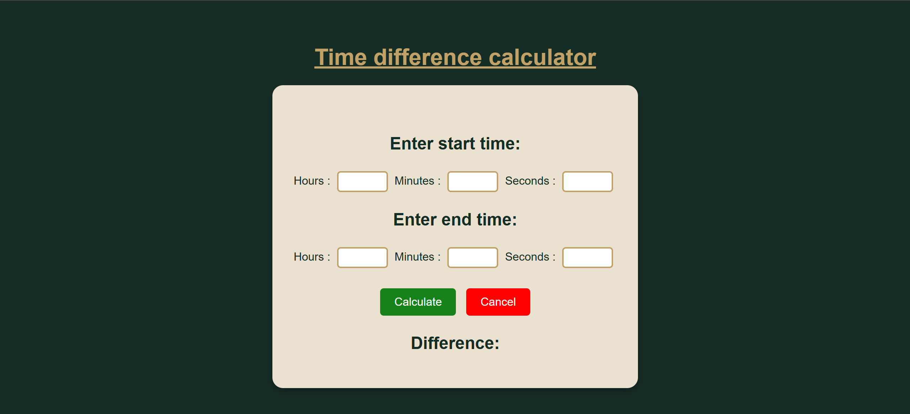

# Time Difference Calculator

A simple and user-friendly web application that calculates the difference between two times. Users can enter start and end times in hours, minutes, and seconds, and the calculator outputs the difference in the HH:MM:SS format.

## Features
- Enter start and end times in hours, minutes, and seconds
- Validates input to allow only integers and proper time ranges
- Automatically handles 24:00 as 00:00
- Displays the time difference clearly
- Stylish and responsive design with a themed container

## Demo



**Live Demo (Optional if hosted on GitHub Pages):**  
[https://your-username.github.io/time-difference-calculator/](https://AkshayaMagesh.github.io/time-difference-calculator/)

## Installation / Usage
1. **Clone the repository:**
   ```bash
   git clone https://github.com/your-username/time-difference-calculator.git
